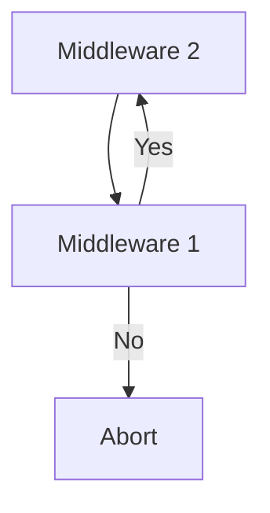

### Introduction

**Tonka** est un **Framework PHP** basé sur le model **MVC** (**M**odel **V**iew **C**ontroller).

# Prérequis

Une configuaration de base de [PHP](https://www.php.net/downloads.php) et de [Apache](https://httpd.apache.org/download.cgi). Vous aurez certainement besoin d'une base de données par la suite. Vous avez le choix entre tous les drivers supportés par [PDO](https://www.php.net/manual/fr/book.pdo.php).

# Dépendances

- [Flesco](https://packagist.org/packages/clicalmani/flesco)   de **Abdoul-Madjid**
- [dotenv](https://packagist.org/packages/vlucas/phpdotenv) de **Vans Lucas**
- [XPower](https://packagist.org/packages/clicalmani/xpower) de **Abdoul-Madjid**

# Installation

`$ git clone https://github.com/honorable85/Toncat.git`

# Documentation

> En cours ...
